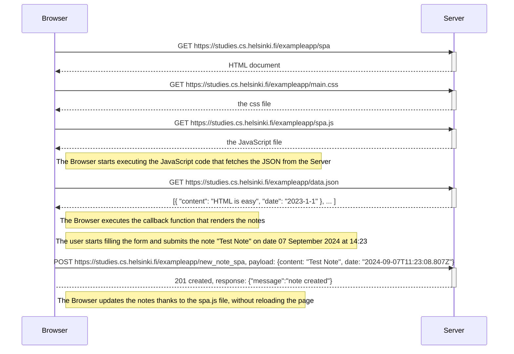

### Exercise
Create a diagram depicting the situation where the user goes to the single-page app version of the notes app at https://studies.cs.helsinki.fi/exampleapp/spa.

---

#### Solution

 

The notes are refreshed for **two reasons**:
1. The `e.preventDefault()` avoids the default behavior of submitting a form (which would invoke a GET request), making it possible to manually submit a POST request.
2. The spa.js file internally calls `redrawNotes()`.